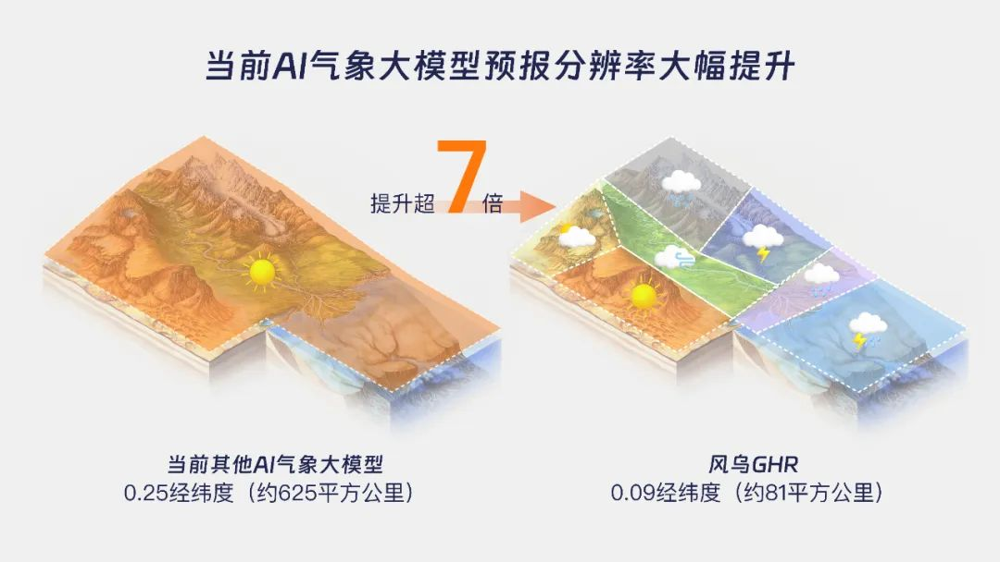
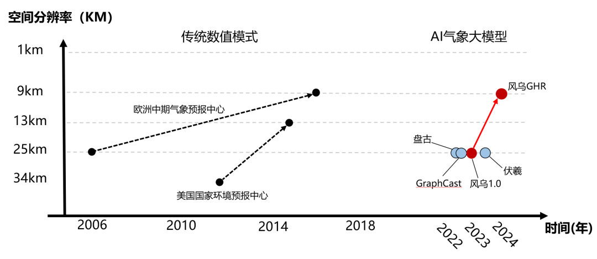

<!-- 

 -->

## AI Weather Forecasting Enters the 10-Kilometer Era with FengWu-GHR

A groundbreaking development in AI weather forecasting, the FengWu-GHR model, has been launched, achieving 10-kilometer scale resolution. This innovative model leverages AI to enhance prediction accuracy, increasing resolution to 0.09 degrees latitude and longitude and extending effective forecast duration to 11.25 days. This advancement allows for detailed and precise weather predictions, overcoming traditional challenges in forecasting localized weather phenomena.

FengWu-GHR's high-resolution capabilities provide significant improvements in core atmospheric variables, demonstrating AI's powerful potential in earth sciences. The model's ability to predict complex weather patterns, such as varying conditions within close proximities, marks a substantial leap forward in meteorological science.

With its precise forecasts, FengWu-GHR is poised to offer invaluable support for industries such as agriculture, disaster prevention, and public safety. This AI-driven model sets a new standard in weather forecasting, emphasizing the significant role of AI in addressing critical environmental and societal challenges.

<!--  -->
<video controls src="demo.mp4" title="Title"></video>
<!--  -->

