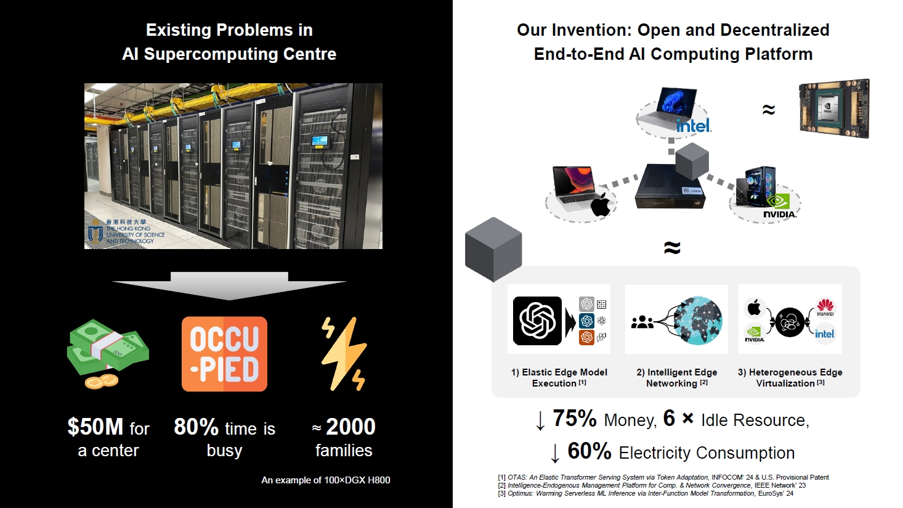
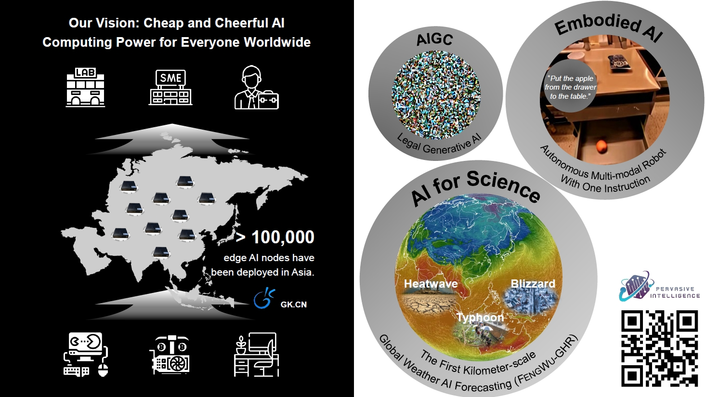
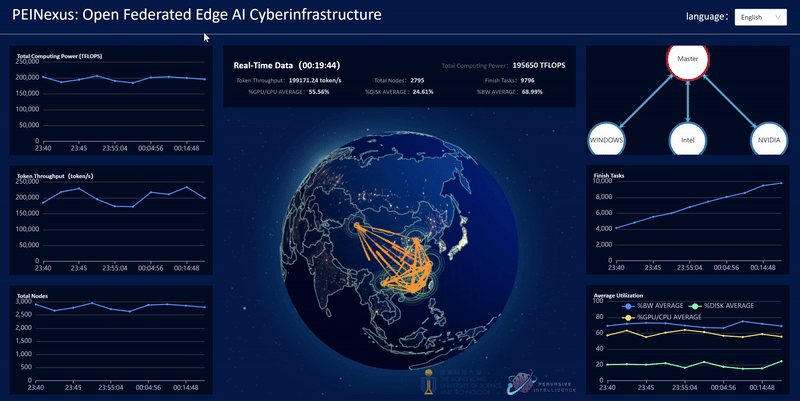

## Background

In the era of foundation models such as ChatGPT and DALL-E, the demand for computing power has skyrocketed. Traditionally, these models have been dependent on cloud servers, which are both expensive and limited in availability. This demo leverages the untapped potential of idle edge devices, including consumer-grade GPUs, laptops, and mobile phones, by transforming them from isolated units into a cohesive network.

## Significance

It utilizes our cutting-edge technologies, including token-adaptive serving, serverless AI, and heterogeneous computing, to provide users with cost-effective, high-quality computing resources tailored for a variety of personalized foundation model services. By decentralizing computing resources, this demo not only reduces latency and improves bandwidth efficiency by bringing computing power closer to the user, but it also enhances data privacy and ensures reliable service, even in regions with unreliable internet connectivity.



