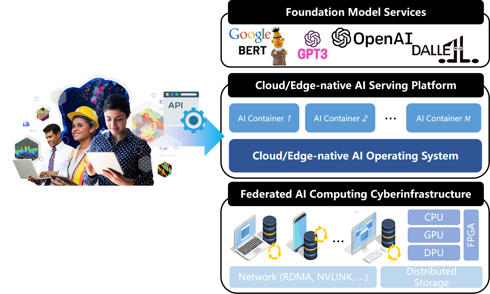

## Background

The unprecedented impact of foundation model technology, represented by ChatGPT, is driving a revolutionary paradigm shift in AI, bringing new opportunities and challenges to many industries. However, the high training, inference and maintenance costs of foundation model technologies limit their widespread adoption. Considering that edge computing power (e.g., edge servers, personal PCs, etc.), which accounts for about 90% of the network, has not yet been effectively used, we focus on a new federated edge AI cyberinfrastructure, and leverages the natural advantages of edge computing power in terms of cost, latency, and privacy, so as to efficiently aggregate the distributed, heterogeneous, and multi-party computing power and become an important computing power supplier in the computing power network, and promote the foundation model technology-based intelligent upgrading of various industries.

## Significance

It utilizes our cutting-edge technologies, including token-adaptive serving, serverless AI, and heterogeneous computing, to provide users with cost-effective, high-quality computing resources tailored for a variety of personalized foundation model services. By decentralizing computing resources, this demo not only reduces latency and improves bandwidth efficiency by bringing computing power closer to the user, but it also enhances data privacy and ensures reliable service, even in regions with unreliable internet connectivity.

<video controls src="PEINexus-1.mp4" title="Title"></video>


