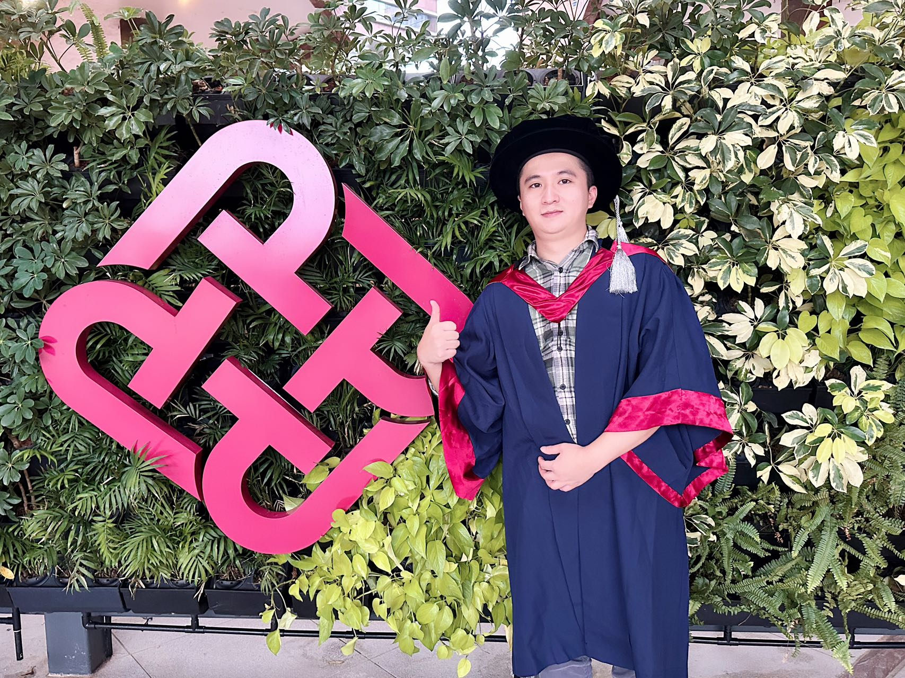

We would like to express our heartfelt congratulations to Dr. Jingcai Guo for the acquisition of his Ph.D. degree. Although Jingcai received his Ph.D. degree in 2021, his graduation ceremony has been postponed to this year due to the impacts of COVID-19.

Jingcai’s research was focusing on machine learning and edge AI, with a particular focus on zero/few-shot learning, federated learning, representation learning, and model compression. 

From 2021 to 2022, he was an Associate Professor with School of Computing and Artificial Intelligence, Southwestern University of Finance and Economics, China. Start from September 2022, he came back to Hong Kong and joined Department of Computing, The Hong Kong Polytechnic University, as a Research Assistant Professor.

Congratulations again to Dr. Jingcai Guo!

