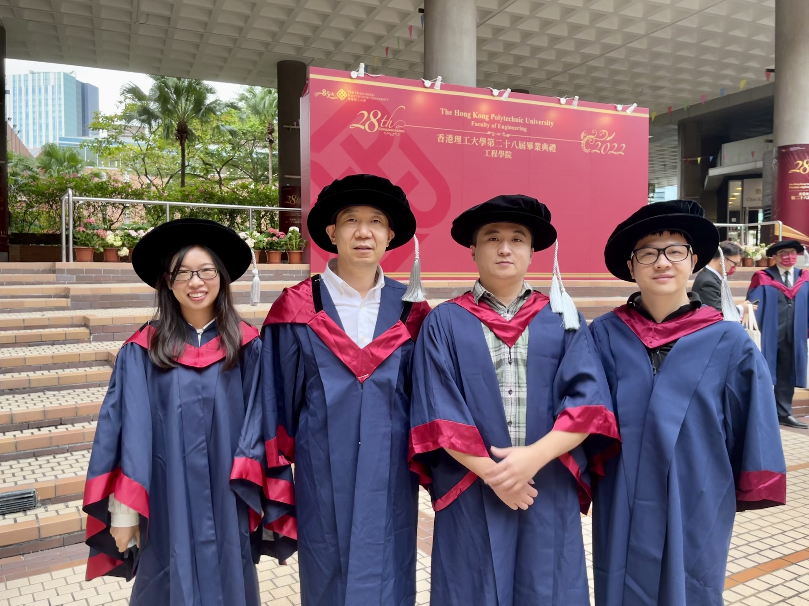

We would like to express our heartfelt congratulations to Dr. Jie Zhang for the acquisition of her PhD degree. 

Jie’s research was focusing on edge computing, federated learning, and computer vision. She published more than 15 papers during her PhD including NIPS, CVPR, DAC, TC, TPDS etc.

She is now working as a Post-doctoral Fellow in PEILab, PolyU, Hong Kong. Wishing all the best for her future career!

