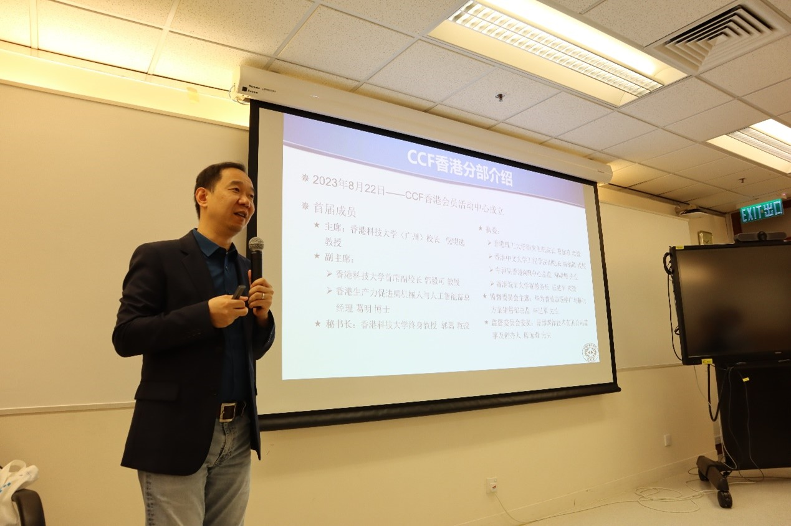
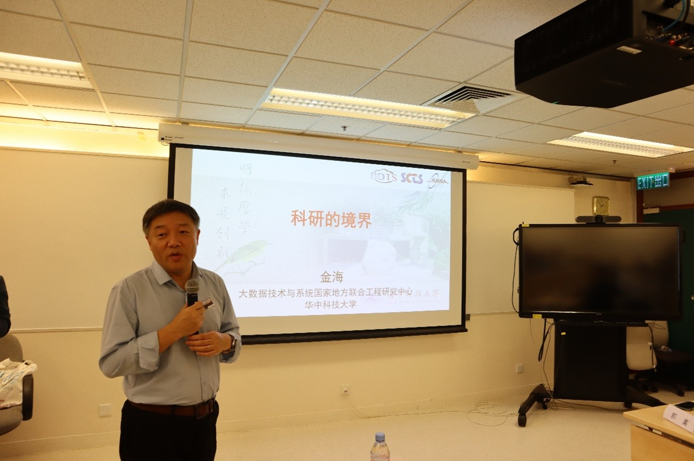
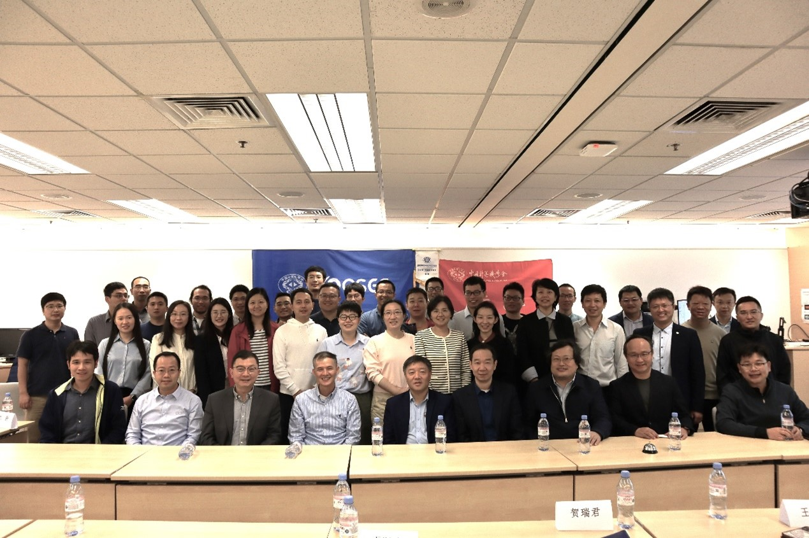
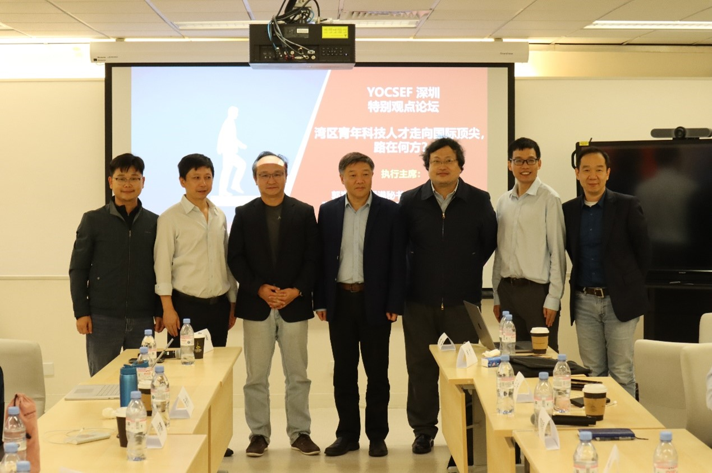

CCF与CCF香港举办《湾区青年科技人才走向国际顶尖，路在何方？》特别观点论坛

 <!--more-->

On December 9, co-sponsored by China Computer Society (CCF) and co-organized by CCF Hong Kong, the "Bay Area Young Science and Technology Talents to the Top of the World, Where is the Road?" The Special Views Forum was held at the Hong Kong Polytechnic University. Professor Jin Hai of Huazhong University of Science and Technology, Professor Song Guo, of Hong Kong University of Science and Technology, and more than 40 other science and technology professionals attended the forum.

Professor GUO Song chaired the opening session. He introduced the background and purpose of the conference, summarized the activities carried out by CCF Hong Kong since its establishment, and pointed out that in a region like the Bay Area, which is very active in technological innovation, YOCSEF is a dynamic platform that can attract young people with academic leadership and industrial innovation ability to showcase their talents.

Professor JIN Hai, Professor WANG Xuan and Professor LI Zhu shared their experiences in academia and encouraged young people to learn more and see more, not to be afraid of setbacks, and to continue to grow in the temper of society.

 

