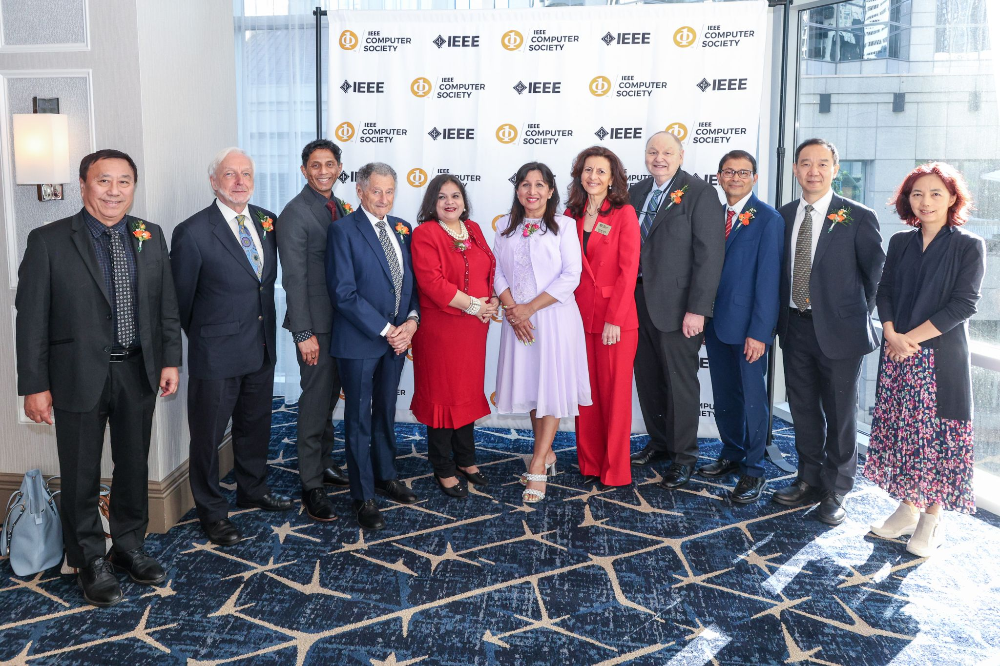

Congratulations to Professor Song Guo for being awarded 2024 Edward J. McCluskey Technical Achievement Award.

<!--more-->

## About the Edward J. McCluskey Technical Achievement Award

A certificate and honorarium are presented for outstanding and innovative contributions to the fields of computer and information science and engineering or computer technology, usually within the past 10, and not more than 15 years.

## Reward Group Photo

## Award-winning video

<iframe width="560" height="315" src="https://www.youtube.com/embed/70sHl5CdiHk?si=PLRO1kJtZvO_ToR4" title="YouTube video player" frameborder="0" allow="accelerometer; autoplay; clipboard-write; encrypted-media; gyroscope; picture-in-picture; web-share" referrerpolicy="strict-origin-when-cross-origin" allowfullscreen></iframe>

