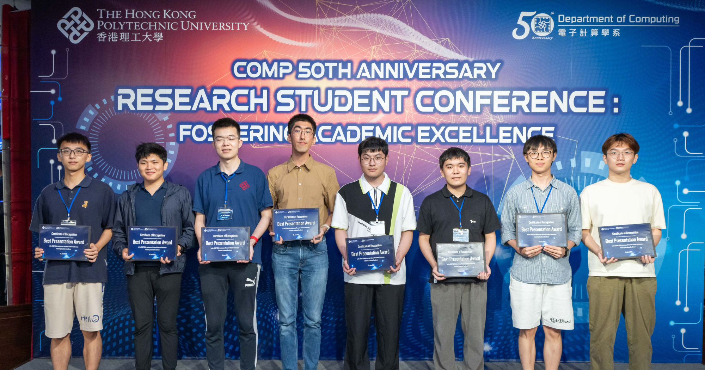

Congratulations to Zicong Hong and Ruibin Li on Their Outstanding Achievements.

<!--more-->

We are thrilled to extend our heartfelt congratulations to Zicong Hong and Ruibin Li for their remarkable accomplishments at the COMP 50th Anniversary Research Student Conference, held on June 24, 2024, at the New World Millennium Hong Kong Hotel.

Zicong Hong was awarded the prestigious Best Presentation Award for his outstanding paper titled "Optimus: Warming Serverless ML Inference via Inter-Function Model Transformation." This recognition highlights his innovative approach and significant contributions to the field of machine learning and serverless computing.

Ruibin Li received the Best Poster Award for his exceptional poster titled "Source Prompt Disentangled Inversion for Boosting Image Editability with Diffusion Models." This accolade underscores his dedication and excellence in advancing image processing techniques.

Both awards are a testament to their hard work, creativity, and commitment to academic excellence. We are incredibly proud of their achievements and look forward to their continued success in their research endeavors.

Once again, congratulations to Zicong Hong and Ruibin Li for their well-deserved awards!

More information refer to [link](https://www.polyu.edu.hk/comp/news-and-events/news/2024/0626_research-student-conference/)