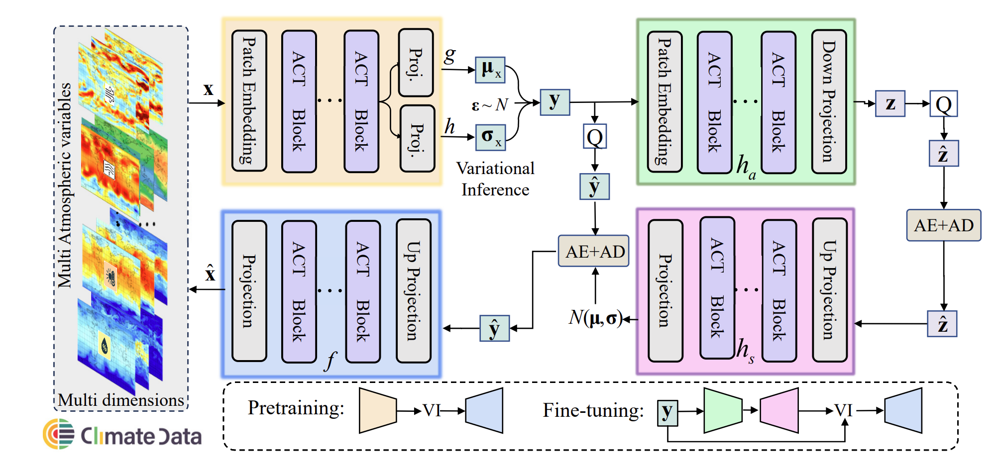
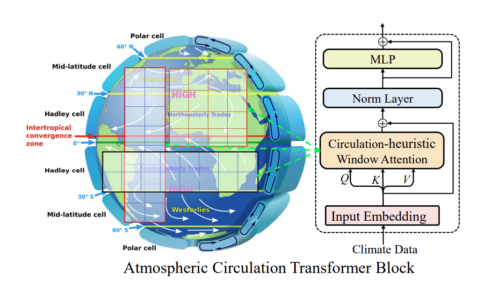

The paper introduces CRA5, a project that uses the Variational Autoencoder Transformer (VAEformer) to compress the ERA5 climate dataset from 226TB to just 0.7TB, achieving a compression ratio of over 300 times. This extreme compression significantly reduces storage costs while preserving the dataset's utility for accurate scientific analysis.

This figure illustrates the comparison between the original ERA5 dataset and the compressed CRA5 dataset, showcasing the dramatic reduction in size. The VAEformer employs a low-complexity Auto-Encoder transformer that generates a quantized latent representation through variance inference, modeling the latent space as a Gaussian distribution. This method improves the estimation of distributions for cross-entropy coding, outperforming existing compression methods.

In this figure, the architecture of the VAEformer is depicted, highlighting its dual transformer-based variational auto-encoder structure. The below figure further details the Atmospheric Circulation Transformer Block, which utilizes different shapes of window attention to simulate various atmospheric circulation patterns. This innovative approach enables efficient data compression while maintaining high numerical accuracy, allowing for training of global weather forecasting models with performance comparable to using the full ERA5 dataset.

