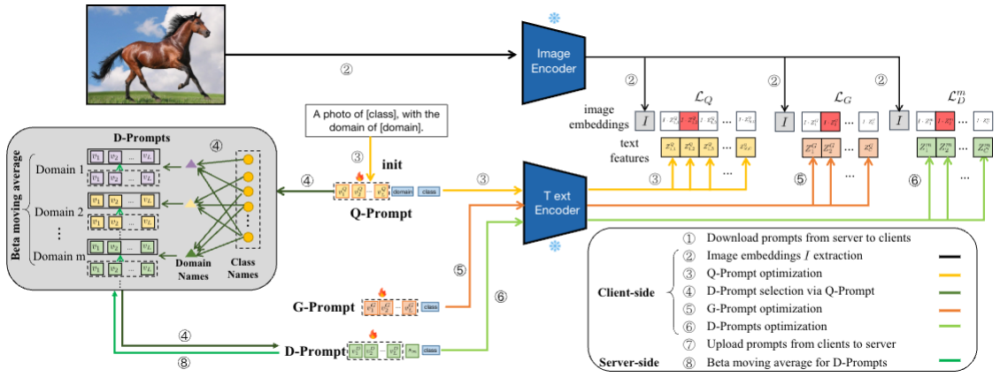

Federated learning (FL) has emerged as a powerful paradigm for learning from decentralized data, and federated domain generalization further considers the test dataset (target domain) is absent from the decentralized training data (source domains). However, most existing FL methods assume that domain labels are provided during training, and their evaluation imposes explicit constraints on the number of domains, which must strictly match the number of clients. Because of the underutilization of numerous edge devices and additional cross-client domain annotations in the real world, such restrictions may be impractical and involve potential privacy leaks. We propose an efficient and novel approach, called Disentangled Prompt Tuning (DiPrompT), a method that tackles the above restrictions by learning adaptive prompts for domain generalization in a distributed manner. The core of DiPrompt includes two types of prompts, i.e., global prompt to capture general knowledge across all clients and domain prompts to capture domain-specific knowledge. They eliminate the restriction on the one-to-one mapping between source domains and local clients. Furthermore, a dynamic query metric is introduced to automatically search the suitable domain label for each sample, which includes two-substep text-image alignments based on prompt tuning without labor-intensive annotation. Extensive experiments demonstrate that our DiPrompT achieves superior domain generalization performance over state-of-the-art FL methods on multiple datasets.

