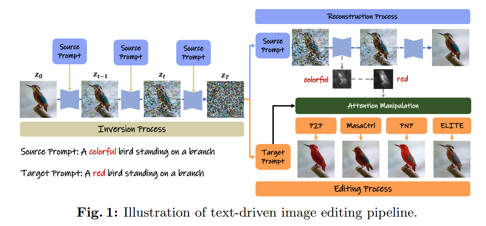
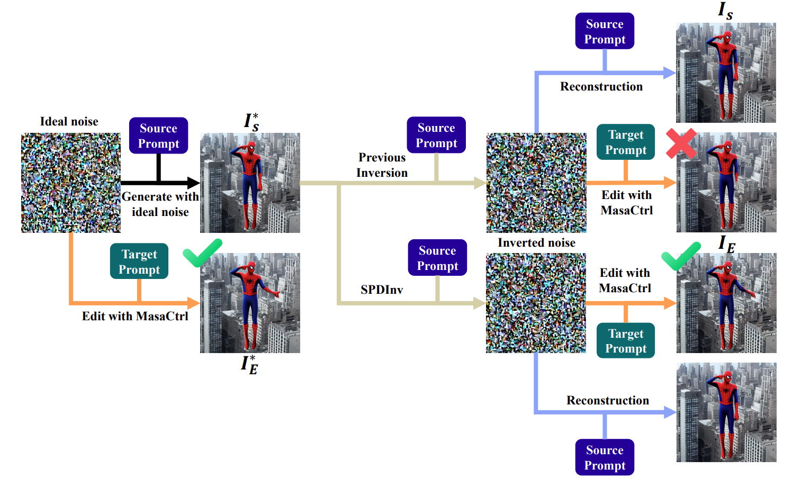

The paper presents a novel method called Source Prompt Disentangled Inversion (SPDInv) to enhance image editability using diffusion models. Traditional approaches often struggle because the inverted latent noise code is closely tied to the source prompt, hindering effective editing with target prompts. SPDInv tackles this by decoupling the noise code from the source prompt, allowing for more flexible and artifact-free edits.

SPDInv transforms the inversion process into a fixed-point search problem, leveraging pre-trained diffusion models to efficiently find solutions. This approach significantly reduces editing artifacts and inconsistencies, improving the overall quality of text-driven image edits.

The method can be easily integrated into existing text-driven editing pipelines, offering a straightforward yet powerful enhancement to current techniques. Experimental results demonstrate that SPDInv effectively reduces source prompt dependency, leading to better editing outcomes.
