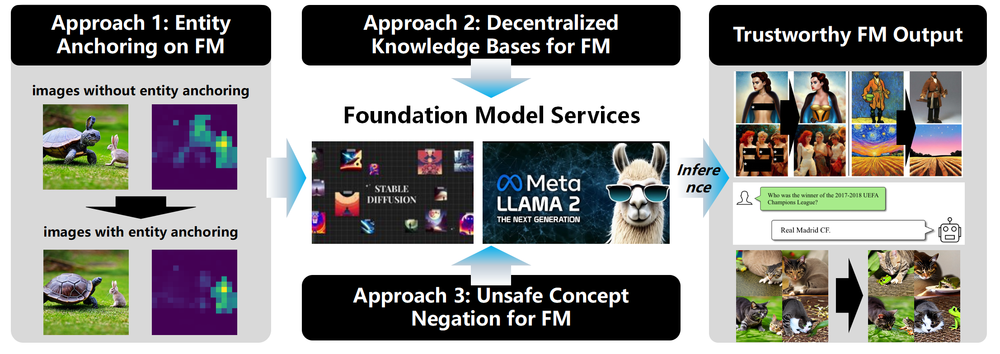

<!-- ### **1. Heterogeneous Data & Resource Constraints: Batch Size Adaptation** -->
The swift advancement of AI-generated content (AIGC) has empowered users to create photorealistic images and engage in meaningful dialogues with foundation models. Despite these advancements, AIGC services face challenges, including concept bleeding, hallucinations, and unsafe content generation. Our objective is to establish a comprehensive set of principles and practices to guide the ethical and responsible development, deployment, and management of machine learning models and data.

We propose many approaches involved three aspects as follows:
- **Entity Anchoring on FM**: This approach involves anchoring entities within images to enhance recognition and interpretation. Images with entity anchoring provide clearer and more precise identification of elements within the image compared to those without entity anchoring. [Details](https://hkpeilab.netlify.app/project/icml-erasing-concept-bleeding/)
- **Decentralized Knowledge Bases for FM**: This approach integrates decentralized knowledge bases to support foundation models, serving as a robust data source for inference. By decentralizing knowledge, the foundation models can access a broader and more diverse set of information. [Details](https://hkpeilab.netlify.app/project/vldb-veridkg/)
- **Unsafe Concept Negation for FM**: This approach focuses on negating unsafe concepts within the outputs of foundation models. By filtering out unsafe or inappropriate content, the models produce safer and more reliable outputs. [Details](https://hkpeilab.netlify.app/project/neuips_towards-test-time-refusals-via-concept-negation/)