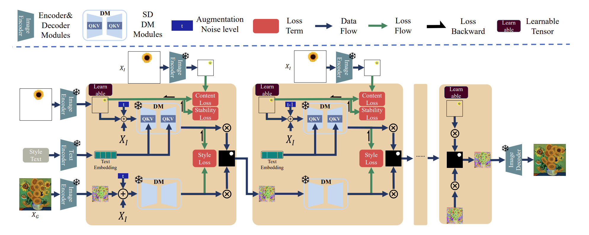
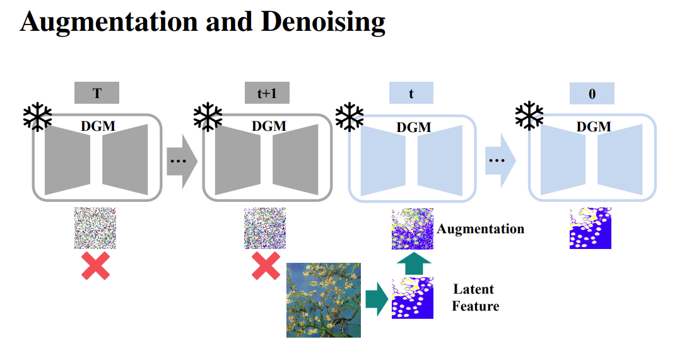
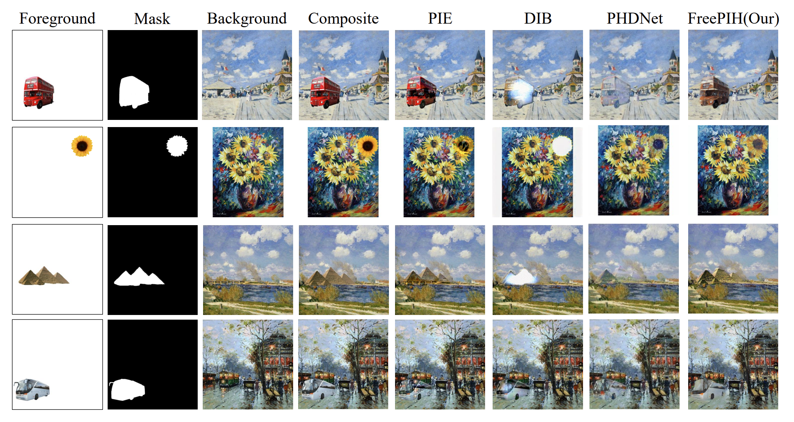

The paper introduces FreePIH, a novel method for painterly image harmonization using a pre-trained diffusion model without additional training. Unlike traditional methods that require fine-tuning or auxiliary networks, FreePIH leverages the denoising process as a plug-in module to transfer the style between the foreground and background images.

FreePIH focuses on the final steps of the denoising process, where stylistic details are most pronounced. It uses Gaussian augmentation on latent features to align styles effectively, ensuring the harmonized image retains both structure and texture.

The method also incorporates multi-scale features to maintain content consistency and stability, enhancing the fidelity of the harmonized image. Additionally, text prompts are employed to improve structural and textural details, giving users more control over the artistic output.

Evaluations on COCO and LAION 5B datasets demonstrate that FreePIH surpasses other methods in producing natural and harmonious images, highlighting its efficiency and effectiveness in image compositing tasks.

