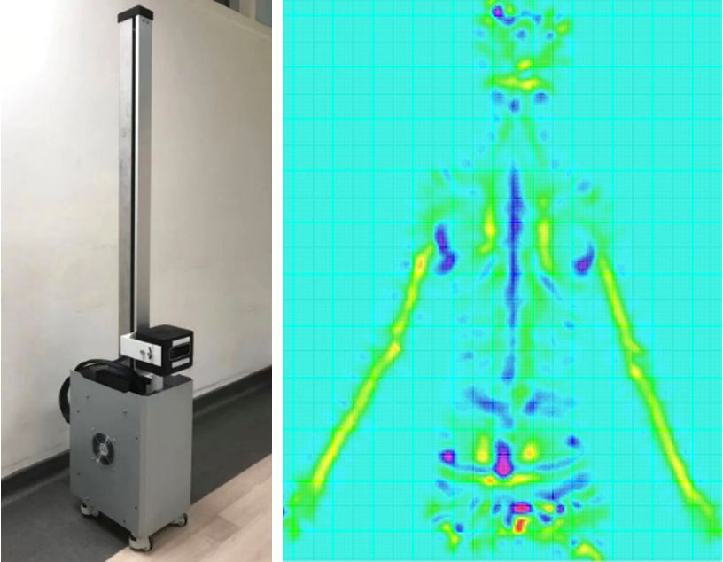

Posture problems such as scoliosis of adolescents are becoming more and more prominent. At present, the mainstream screening method is still manual detection, which has low detection efficiency and low accuracy. 

At the same time, facing the severe shortage of physiotherapists and the impact of the epidemic, in order to help more people with rehabilitation needs realize remote screening and tracking and real-time AI monitoring of sports rehabilitation at home. A mobile-based posture screening algorithm and real-time exercise rehabilitation tracking algorithm are proposed.

In order to solve the problems of delay and privacy leakage caused by cloud computing, the research team introduced edge learning technology, quantified and compressed the algorithm model, and realized inference calculation on the mobile terminal (including the mobile terminal). It is used to help realize remote online assessment of posture (bad posture of the spine) and real-time sports rehabilitation tracking.

At present, it has cooperated with West China Hospital, Hong Kong Rehabilitation Association, Hong Kong Lutheran Society and other institutions. 
