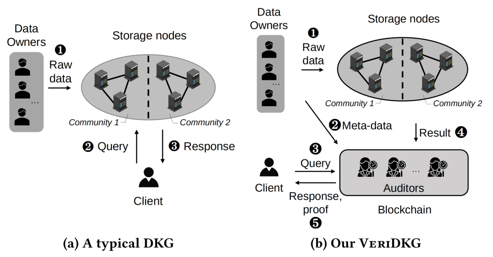

The ability to decentralize knowledge graphs (KG) is important to exploit the full potential of the Semantic Web and realize the Web 3.0 vision. However, decentralization also renders KGs more prone to attacks with adverse effects on data integrity and query verifiability. While existing studies focus on ensuring data integrity, how to ensure query verifiability - thus guarding against incorrect, incomplete, or outdated query results - remains unsolved. We propose VeriDKG, the first SPARQL query engine for decentralized knowledge graphs (DKG) that offers both data integrity and query verifiability guarantees. The core of VeriDKG is the RGB-Trie, a new blockchain-maintained authenticated data structure (ADS) facilitating correctness proofs for SPARQL query results. VeriDKG enables verifiability of subqueries by gathering global index information on subgraphs using the RGB-Trie, which is implemented as a new variant of the Merkle prefix tree with an RGB color model. To enable verifiability of the final query result, the RGB-Trie is integrated with a cryptographic accumulator to support verifiable aggregation operations. A rigorous analysis of query verifiability in VeriDKG is presented, along with evidence from an extensive experimental study demonstrating its state-of-the-art query performance on the largeRDFbench benchmark.

