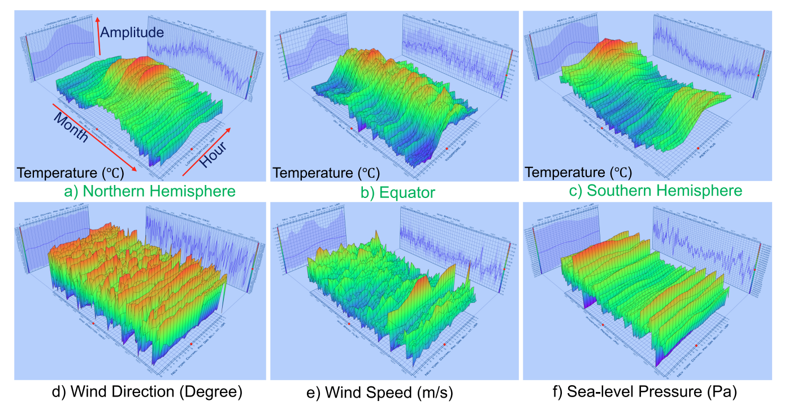

The paper presents the WEATHER-5K dataset, a comprehensive global weather station dataset designed to advance time-series weather forecasting benchmarks. WEATHER-5K includes data from 5,672 weather stations worldwide, covering a 10-year period with hourly intervals. It features multiple crucial weather variables, making it a valuable resource for evaluating and improving forecasting models.

The dataset addresses limitations in existing public datasets, such as small size and limited temporal coverage, by providing a diverse and extensive collection of weather data. This allows for a more accurate reflection of real-world conditions and supports the development of models capable of generalizing across various regions and timeframes.

Additionally, the dataset facilitates research beyond traditional methods, encouraging exploration in deep learning and data-driven approaches to improve forecast accuracy. Overall, WEATHER-5K serves as a robust foundation for advancing both operational weather services and scientific research in time-series forecasting.

