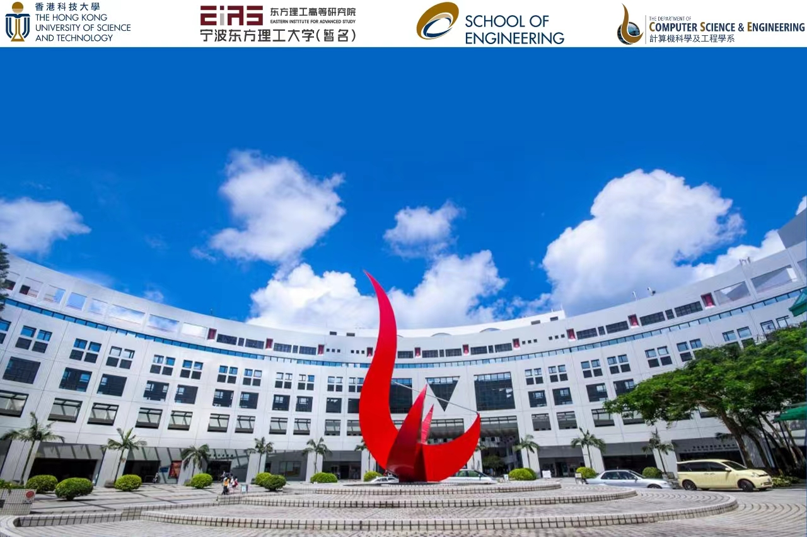

<!--more-->

## Organizing Committee

### Conference Co-chairs 
Jingxu Zhu, Western University, London, Ontario, Canada (jzhu@uwo.ca)

Song Guo, The Hong Kong University of Science and Technology, Hong Kong (songguo@cse.ust.hk)

Guohua Chen, City University of Hong Kong, Hong Kong (guohchen@cityu.edu.hk)

### Steering Committee
Yike Guo, The Hong Kong University of Science and Technology, Hong Kong

Victor C. M. Leung, The University of British Columbia (UBC), Vancouver, Canada 

### Program Chair
Peng Li, The University of Aizu, Japan (pengli@u-aizu.ac.jp)

Wenchao Xu,  The Hong Kong Polytechnic University (PolyU), Hong Kong (wenchao.xu@polyu.edu.hk)

Jingcai Guo,  The Hong Kong Polytechnic University (PolyU), Hong Kong (jc-jingcai.guo@polyu.edu.hk)

## Program 

| Time          | Session                                                      | Speaker                         |
| :------------ | :----------------------------------------------------------- | :------------------------------ |
| 08:45 - 09:00 | Registration                                              | N/A |
| 09:00 - 09:30 | Opening Ceremony | Prof. Dong Sun, Prrf. Yike Guo, Prof. Jesse Zhu           |
| 09:30 - 09:45 | [Topic：Infinite Possibilities in the World of Science – New Journey of Energy & Automotive Revolutions](talk1) | Prof. C. C. Chan (陈清泉)          |
| 09:45 - 10:00 | [Construction of a new research-oriented university (新型研究型大学建设)](talk2) | Prof. Dongxiao Zhang (张东晓)               |
| 10:00 - 10:15 | [TBD](talk3) | Prof. Aibing Yu (余艾冰)               |
| 10:15 - 10:30 | [TBD](talk4) | Prof. Weimin Zheng (郑纬民)            | 
| 10:30 - 10:50 | Coffee Break | N/A                |
| 10:50 - 11:05 | [Topic: Explainable AI (浅谈可解释人工智能)](talk5) | Prof. Wenjun Zeng (曾文军)                  |
| 11:05 - 11:20 | [Topic: The innovation and generalization of AI+ (AI+ 创新与泛化应用)](talk6) | Prof. Dapeng Zhang (张大鹏)                   |
| 11:20 - 11:35 | [Topic: Development of floating structures to promote sustainable development of the Greater Bay Area (发展漂浮结构促进大湾区持续发展)](talk7) | Prof. Xiaolin Zhao (赵晓林)                  |
| 11:35 - 11:50 | [Topic: Australian blue economy and partnership opportunities with China](talk8) | Prof. Wei Zhang (张卫)           |
| 11:50 - 14:00 | Lunch | N/A           |
| 14:00 - 14:15 | [Topic: Challenges and perspectives of chemical industry towards carbon neutrality](talk9) |  Prof. De Chen (陈德)            |
| 14:15 - 14:30 | [Topic: Progress and Prospects of Next-Generation Metamorphic Evolutional Robots (新一代变胞结构进化机器人进展与前景)](talk10) | Prof. Jiansheng Dai (戴建生)|
| 14:30 - 14:45 | [Topic: Advanced Biorefinery - A Greener Way Towards Carbon Neutrality](talk11) | Prof. Charles XU (徐春保)           |
| 14:45 - 15:00 | [TBD](talk12) | Prof. Zaiping Guo (郭再萍)          |
| 15:00 - 15:15 | Coffee Break | N/A |
| 15:15 - 15:30 | [Topic: A greener future: next generation tandem cells](talk13) | Prof. Xiaojing Hao (郝晓静)          |
| 15:30 - 15:45 | [Topic: Microseismic Monitoring, Early Warning, and Prevention of Mining Power Hazards (矿山动力灾害微地震监测预警及其防治)](talk14) | Prof.Yunxing Cao (曹运兴)         |
| 15:45 - 16:00 | [Topic: The Status and Future of Robotics System for Vascular Interventional Surgery (泛血管介入手术机器人技术的现状和未来)](talk15) | Prof. Shuxiang Guo (郭书祥)          |
| 16:00 - 16:15 | [Topic: Preparation of low negative carbon building materials and products by carbon mineralization (碳矿化制备低负碳建筑材料和制品)](talk16) | Prof. Caijun Shi (史才军)   |   
| 16:15 - 16:30 | [TBD](talk17) | Prof. Jesse Zhu (祝京旭)|
| 16:30 - 17:30 | Panel Discussion [ Possible Topic: Future Directions of Basic Sciences in the era of Intelligence](talk18) | Possible participants: Prof. Zhongchao Tan (谭忠超, Eastern Institute of Technology), Yulong Ding (丁玉龙, University of Birmingham), Zhibing Zhang (张志兵, University of Birmingham),  Shiping Zhu (朱世平, Chinese University of Hong Kong, Shenzhen), Zhiguo Yuan (袁志国, City University of Hong Kong), John Shi (史文中, The Hong Kong Polytechnic University) |

