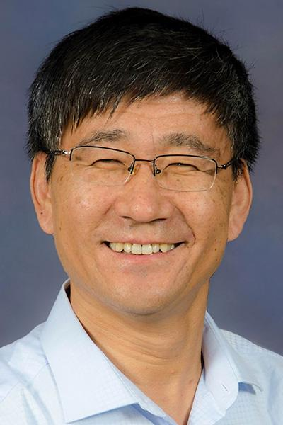
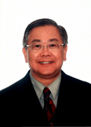
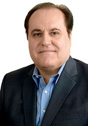
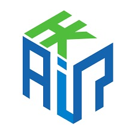

# International Workshop on Edge Intelligence and Future Network- towards Ubiquitous Connectivity 

## Introduction

## Organizer

 

## Organizing Committee

Organizing Chair Prof. Xuemin (Sherman) Shen

Workshop Chair: Prof. Song Guo 

## Program Schedule

| Time | Session | Speaker  |
| ------------------------------------------------------------ | :----------------------------------------------------------- | :----------------------------------------------------------- |
| 08:45 - 09:00                                                | Opening Session                                              | Song Guo                                                     |
| 09:00 - 09:45                                                | Talk 1: Computation Offloading and Task Scheduling onthe Network Edge | Xuemin (Sherman) Shen                                        |
| 09:45 - 10:30                                                | Talk 2: Vehicle as a Service (VaaS): How to Leverage Vehicles to Beef Up the Edge | Yuguang (Michael) Fang                                       |
| 10:30 - 11:15                                                | Talk 3: Task Scheduling for Multi-Access Edge Computing in IRS-Aided Vehicular Networks | Nei Kato                                                     |
| 11:15 - 12:00                                                | Talk 4: AIoT as a Service – Framework, Opportunities, and Challenges | Victor C.M. Leung                                            |
| 12:00 - 14:00                                                | Lunch Break                                                  | N/A                                                          |
| 14:00 - 14:45                                                | Talk 5: Edge-AI and Mission-critical Industrial Applications | Albert Y. Zomaya                                             |
| 14:45 - 15:30                                                | Talk 6: 区块链 – 零信任之上的共识                            | Xiuzhen Cheng                                                |
| 15:30 - 16:15                                                | Talk 7: Edge Intelligence and V2X Enabled Autonomous Driving | Jianping Wang                                                |
| 16:15 - 17:00                                                | Talk 8: Industrial Talk                                      | TBD                                                          |

## Keynote

#### Talk1:  **Computation Offloading and Task Scheduling on the Network Edge**

**Speaker:** Xuemin (Sherman) Shen, University Professor, Fellow of RSC, CAE, EIC, IEEE 

Foreign Academian of Chinese Academy of Engineering

Department of Electrical and Computer Engineering, University of Waterloo

Xuemin (Sherman) Shen received the Ph.D. degree in electrical engineering from Rutgers University, New Brunswick, NJ, USA, in 1990. He is a University Professor with the Department of Electrical and Computer Engineering, University of Waterloo, Canada. His research focuses on network resource management, wireless network security, Internet of Things, 5G and beyond, and vehicular ad hoc and sensor networks. Dr Shen is a registered Professional Engineer of Ontario, Canada, an Engineering Institute of Canada Fellow, a Canadian Academy of Engineering Fellow, a Royal Society of Canada Fellow, a Chinese Academy of Engineering Foreign Member, and a Distinguished Lecturer of the IEEE Vehicular Technology Society and Communications Society.

Dr. Shen received the R.A. Fessenden Award in 2019 from IEEE, Canada, Award of Merit from the Federation of Chinese Canadian Professionals (Ontario) in 2019, James Evans Avant Garde Award in 2018 from the IEEE Vehicular Technology Society, Joseph LoCicero Award in 2015 and Education Award in 2017 from the IEEE Communications Society, and Technical Recognition Award from Wireless Communications Technical Committee (2019) and AHSN Technical Committee (2013). He has also received the Excellent Graduate Supervision Award in 2006 from the University of Waterloo and the Premier’s Research Excellence Award (PREA) in 2003 from the Province of Ontario, Canada. He served as the Technical Program Committee Chair/Co-Chair for IEEE Globecom’16, IEEE Infocom’14, IEEE VTC’10 Fall, IEEE Globecom’07, and the Chair for the IEEE Communications Society Technical Committee on Wireless Communications. Dr. Shen is the President of the IEEE Communications Society. He was the Vice President for Technical \& Educational Activities, Vice President for Publications, Member-at-Large on the Board of Governors, Chair of the Distinguished Lecturer Selection Committee, and Member of IEEE Fellow Selection Committee of the ComSoc. Dr. Shen served as the Editor-in-Chief of the IEEE IoT JOURNAL, IEEE Network, and IET Communications.

**Abstract:** Next-generation wireless networks are anticipated to provide connectivity for massive mobile devices and to enable a variety of innovative applications, which also generate enormous computing service demands with diverse and stringent Quality of Service (QoS) requirements. Mobile Edge Computing (MEC), as cutting-edge technology in next-generation networks, can utilize computing resources on the network edge to provide computing services for mobile devices within a radio access network. In this talk, we will investigate computing resource management for MEC, We will introduce two computation offloading and task scheduling schemes tailored for supporting representative use cases and network scenarios in next-generation wireless networks, including the Internet of Vehicles and mobile virtual reality video streaming. Data-model-driven resource management approaches will be exploited to facilitate low-latency and reliable computing services in complex and dynamic network environments.

#### **Talk 2: Vehicle as a Service (VaaS): How to Leverage Vehicles to Beef Up the Edge** 

**Speaker:** Yuguang (Michael) Fang, Distinguished Professor, Fellow of AAAS, IEEE

Department of Electrical and Computer Engineering, University of Florida 

Dr. Yuguang "Michael" Fang received MS degree from Qufu Normal University, Shandong, China in 1987, PhD degree in Systems and Control Engineering from Case Western Reserve University in 1994 and PhD degree in Electrical and Computing Engineering from Boston University in 1997. He was an assistant professor in the Department of Electrical and Computer Engineering at New Jersey Institute of Technology from 1998 to 2000. He then joined the Department of Electrical and Computer Engineering at University of Florida in 2000 as an assistant professor, then was promoted to an associate professor in 2003 and a full professor in 2005 and has been a distinguished professor since 2019. He holds University of Florida Preeminence Term Professorship (2019-2022), University of Florida Research Foundation (UFRF) Professorship (2006-2009, 2017-2020), and University of Florida Term Professorship (2017-2019, 2019-2021). 

Dr. Fang received the US National Science Foundation Career Award in 2001 and the Office of Naval Research Young Investigator Award in 2002, 2018 IEEE Vehicular Technology Outstanding Service Award, 2019 Communications Society AHSN Technical Achievement Award, 2015 IEEE Communications Society CISTC Technical Recognition Award, 2014 IEEE Communications Society WTC Recognition Award, and multiple Best Paper Awards from IEEE Globecom (2015, 2011 and 2002) and IEEE ICNP (2006). He has also received the 2019 ECE Faculty Excellence Award in Research, 2010-2011 UF Doctoral Dissertation Advisor/Mentoring Award, and the 2009 UF College of Engineering Faculty Mentoring Award. He served as the Editor-in-Chief of IEEE Transactions on Vehicular Technology (2013-2017) and IEEE Wireless Communications (2009-2012), and serves/served on several editorial boards of journals including the Proceedings of the IEEE (2018-present), ACM Computing Surveys (2017-present), IEEE Transactions on Mobile Computing (2003-2008, 2011-2016), IEEE Transactions on Communications (2000-2011), and IEEE Transactions on Wireless Communications (2002-2009). He has been actively participating in conference organizations such as serving as the Technical Program Co-Chair for IEEE INFOCOM’2014 and the Technical Program Vice-Chair for IEEE INFOCOM'2005. He is the Director of Magazines of IEEE Communications Society and a Distinguished Speaker of IEEE Vehicular Technology. He is a fellow of the IEEE (2008) and a fellow of the American Association for the Advancement of Science (AAAS) (2015). 

**Abstract:** Connected and autonomous vehicles (CAVs) and/or Internet of Vehicles (IoV) in general have attracted tremendous attention in recent years. They have been shown to be useful not only for traffic management and control, but also for diverse innovative applications to improve people’s quality of life. Observing that the most popular and omnipresent things in any city are vehicles, if each vehicle is equipped with powerful capability in communications, computing, storage, and intelligence (CCSI capability), such vehicles roaming around a city will automatically form a dynamic web of sensing, computing, communications, control, and/or edge intelligence, potentially providing an economically sound alternative solution to realizing the vision of smart city. In this talk, the speaker will discuss how to leverage connected CCSI enabled vehicles to take full advantage of both vehicular mobility and spectrum/computing  opportunity to beef up the edge for various kinds of smart city services. 

#### Talk3: **Task Scheduling for Multi-Access Edge Computing in IRS-Aided Vehicular Networks**

**Speaker:** Nei Kato, Professor, Fellow of IEEE

Graduate School of Information Sciences, Tohoku University

 Nei Kato is a full professor and the Dean with Graduate School of Information Sciences, Tohoku University. He has researched on computer networking, wireless mobile communications, satellite communications, ad hoc & sensor & mesh networks, UAV networks, smart grid, AI, IoT, Big Data, and pattern recognition. He has published more than 500 papers in prestigious peer-reviewed journals and conferences. He is the Director of Magazine of IEEE Communications Society. He served as the Vice-President (Member & Global Activities) of IEEE Communications Society (2018-2021), the Editor-in-Chief of IEEE Network Magazine(2015-2017), and the Editor-in-Chief of IEEE Transactions on Vehicular Technology (2017-2021). He is a Distinguished Lecturer of IEEE Communications Society and Vehicular Technology Society, a Fellow of the Engineering Academy of Japan, a Fellow of IEEE, and a Fellow of IEICE.

**Abstract:** Multi-access Edge Computing (MEC) has played an important role in realizing intelligent beyond 5G (B5G) vehicular networks. The computation tasks of intelligent applications can be offloaded to and processed by near-end-user MEC servers to meet strict latency requirements. However, the latency of provided services is dependent on MEC processor scheduling and millimeter wave (mmWave) transmission conditions for the urban B5G vehicular networks. To alleviate the mmWave signal attenuation caused by buildings, Intelligent Reflecting Surface (IRS) has been regarded as efficient and prospective infrastructure. In this paper, we study the IRS-aided MEC-served vehicular networks and analyze the relationship between computation resource allocation and offloading policy at an intersection. Considering the vehicle mobility patterns, transmission conditions, and task sizes, we optimize the task scheduling by improving the allocation of limited processors and IRS resource. Moreover, the mutual interference among concurrent transmissions is taken into account. In this presentation, by assuming the moving directions available, a dynamic task scheduling algorithm is presented which considers both the communications and computations. The simulation results illustrate that the new scheme outperforms benchmark methods in terms of task offloading rate, computing rate, and finish rate for the IRS-aided MEC-served vehicular networks.

#### **Talk 4: AIoT as a Service – Framework, Opportunities, and Challenges**

**Speaker:** Victor C.M. Leung, Distinguished Professor, Fellow of RSC, FCAE, FEIC, Life Fellow of IEEE

Distinguished Professor of Computer Science and Software Engineering, Shenzhen University
Emeritus Professor of Electrical and Computer Engineering, The University of British Columbia

Victor C. M. Leung is a Distinguished Professor of Computer Science and Software Engineering at Shenzhen University. He was a Professor of Electrical and Computer Engineering and inaugural holder of the TELUS Mobility Research Chair at the University of British Columbia (UBC) before he became an Emeritus Professor at UBC in 2019. His research is in the broad areas of wireless networks and mobile systems, in which he has co-authored more than 1400 refereed journal/conference papers and book chapters. Dr. Leung is serving on the editorial boards of the IEEE Transactions on Green Communications and Networking, IEEE Transactions on Cloud Computing, IEEE Transactions on Computational Social Systems, IEEE Network, IEEE Access, and several other journals. He received the IEEE Vancouver Section Centennial Award, the 2011 UBC Killam Research Prize, the 2017 Canadian Award for Telecommunications Research, the 2018 IEEE TCGCC Distinguished Technical Achievement Recognition Award, and the 2018 MSWiM Reginald Fessenden Award. He co-authored papers that won the 2017 IEEE ComSoc Fred W. Ellersick Prize, the 2017 IEEE Systems Journal Best Paper Award, the 2018 IEEE CSIM Best Journal Paper Award, and the 2019 IEEE TCGCC Best Journal Paper Award. His name is included in the current Clarivate Analytics list of “Highly Cited Researchers”. He is a Life Fellow of IEEE, the Royal Society of Canada, the Canadian Academy of Engineering and the Engineering Institute of Canada.

**Abstract:** With the increasing adoption of Internet of Things (IoT) and rapid advancements of Artificial Intelligence (AI) applications, the integration of AI and IoT, widely referred as AIoT, is gaining momentum. Realizing AIoT will require massive investments in infrastructure, and lessons learned from network deployments point to the use of shared hardware and software resources that can be virtualized to support various services on demand, resulting in AIoT-as-a-Service (AIoTaaS). In this talk, we start with a review of the idea of Anything-as-a-Service (XaaS), leading to IoTaaS and AIaaS, which form the basis of AIoTaaS. We present a framework for AIoTaaS, which incorporates edge and cloud computing platforms to support the AI functionalities required for different services. Enabled by cloud and edge computing, AIoTaaS can effectively implement machine learning (ML) training and inference functions on cloud and edge devices with much less complexity to enable efficient and effective AI decision making in IoT and data analytics, especially in the area of streaming data and real-time analytics associated with edge computing networks. To implement AIoTaaS, interoperability between components at the device level, software level and platform level should be extended while optimizing system and network operations as well as extracting value from data. In the future, AIoTaaS integrated with 5G and blockchain will be leveraged to achieve more efficient IoT operations, improve human-machine interactions, and enhance data management and analytics, creating a foundation for pervasive AI services and applications.

#### **Talk 5: Edge-AI and Mission-critical Industrial Applications**

**Speaker:** Albert Y. Zomaya, Peter Nicol Russell Chair Professor, Fellow of AAAS, IEEE

Peter Nicol Russell Chair Professor of Computer Science, University of Sydney 
Director of the Centre for Distributed and High-Performance Computing, University of Sydney

Albert Y. ZOMAYA is Peter Nicol Russell Chair Professor of Computer Science and Director of the Centre for Distributed and High-Performance Computing at the University of Sydney. To date, he has published > 700 scientific papers and articles and is (co-)author/editor of >30 books. A sought-after speaker, he has delivered >250 keynote addresses, invited seminars, and media briefings. He is currently the Editor in Chief of the ACM Computing Surveys and served in the past as Editor in Chief of the IEEE Transactions on Computers (2010-2014) and the IEEE Transactions on Sustainable Computing (2016-2020).

Professor Zomaya is a decorated scholar with numerous accolades including Fellowship of the IEEE, the American Association for the Advancement of Science, and the Institution of Engineering and Technology. He is a Fellow of the Royal Society of New South Wales, Foreign Member of Academia Europaea, and Member of the European Academy of Sciences and Arts. Some of Professor Zomaya recent awards include the New South Wales Premier’s Prize of Excellence in Engineering and Information and Communications Technology (2019) and the Research Innovation Award, IEEE Technical Committee on Cloud Computing (2021). His research interests lie in parallel and distributed computing, networking, and complex systems.

**Abstract:** In the past few decades, industrial automation has become a driving force in a wide range of industries. There is a broad agreement that the deployment of computing resources close to where data is created is more business-friendly, as it can address system latency, privacy, cost, and resiliency challenges that a pure cloud computing approach cannot address. This computing paradigm is now known as Edge Computing. Having said that, the full potential of this transformation for both of computing and data analytics is far from being realized. The industrial requirements are much more stringent than what a simple edge computing paradigm can deliver. This is particularly true when mission-critical industrial applications have strict requirements on real-time decision making, operational technology innovation, data privacy, and running environment. In this talk, I aim to provide a few answers by combining real-time computing strengths into modern data- and intelligence-rich computing ecosystems. I will also explore the topic of Edge AI, which is a process in which the Edge systems uses machine learning algorithms to process data generated by the user’s devices. 

#### **Talk 6: 区块链 – 零信任之上的共识**

**Speaker:** Xiuzhen Cheng 成秀珍, Professor, FIEEE

成秀珍教授现担任山东大学计算机科学与技术学院院长及山东省数链融合技术创新中心主任，是IEEE Fellow、国家高层次海外人才、国家重点研发计划首席科学家、山东省“泰山学者”海外特聘专家。成教授于1991年本科毕业于国防科技大学电子工程系， 2002年博士毕业于美国明尼苏达大学双城分校计算机科学系。从2002到2020年在美国乔治华盛顿大学历任助理教授、终身副教授、终身教授。现主要研究方向为安全与隐私保护、区块链理论与应用、物联网与边缘计算等。曾担任（或正在担任)多家期刊编委及多个国际会议主席，是中国计算机学会推荐国际学术会议WASA的创办者和山大- Elsevier国际期刊《High-Confidence Computing》的创刊主编。

**Abstract:** 本报告主要回答两个问题：1、为什么说区块链的本质是零信任情况下实现多主体间成功协作的技术；2、拓展区块链应用面临哪些挑战。最后介绍一下我们在区块链方向上所做的一些工作。 

#### **Talk 7: Edge Intelligence and V2X Enabled Autonomous Driving**

**Speaker:** Jianping Wang

Department of Computer Science, City University of Hong Kong

 Prof. Jianping Wang is currently a professor in the Department of Computer Science at the City University of Hong Kong and the assistant provost (Strategic Planning and Quality Assurance). Her research interests are resource allocation and system dependability in Autonomous Driving, V2X, Networking Systems, Edge Computing, and Cloud Computing. Her research has been supported by various funding agencies and industry companies. She has published around 200 papers in prestigious journals and conferences. She has been serving or served on the editorial board of several prestigious IEEE transactions/journals such as IEEE Transactions on Parallel and Distributed Systems, IEEE Transactions on Cloud Computing, IEEE Transactions on Mobile Computing, IEEE Internet of Things journal. She is recognized in the Top 2% Scientists Worldwide in a study from Stanford University.

**Abstract:** TBD

#### **Talk 8: Industrial Talk**

**Speaker:** TBD

**Abstract:** TBD

## Sponsor

